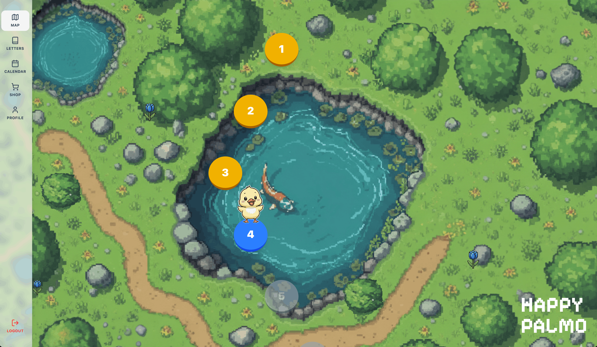
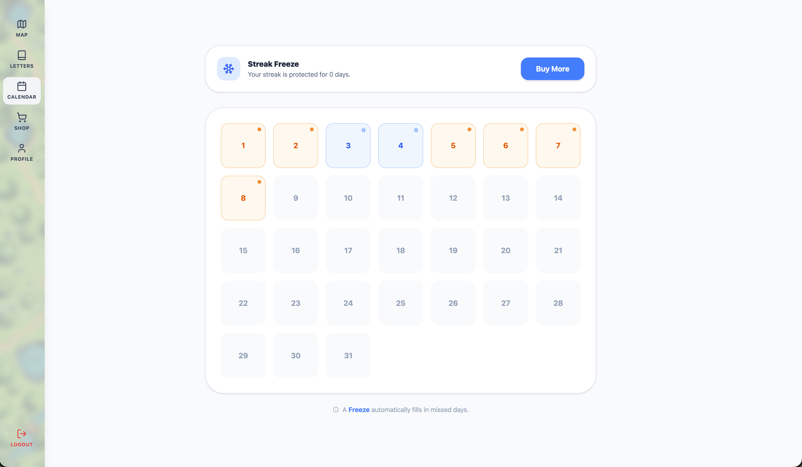
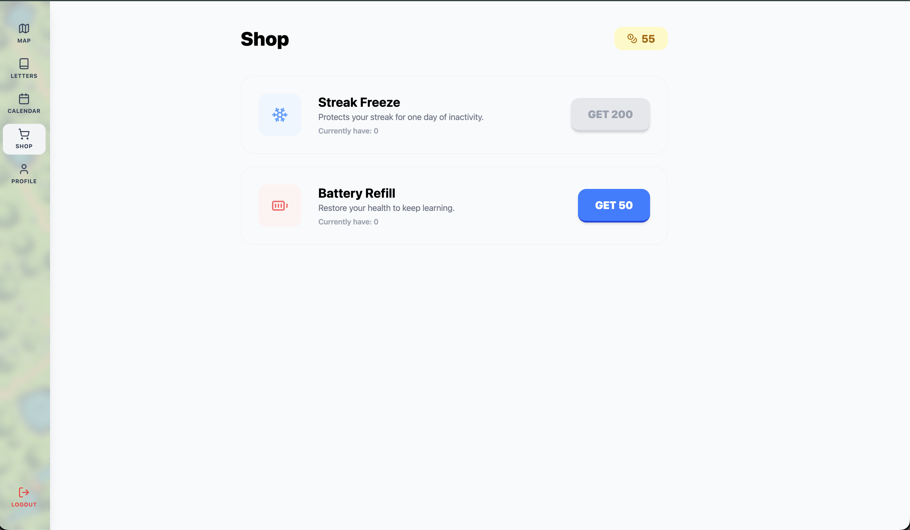

# 🐥 Palmo

🎬 [Watch our hackathon demo on YouTube]



## Table of Contents
- [Summary](#summary)
- [Motivation](#motivation)
- [Requirements](#requirements)
- [Tech Stack](#tech-stack)
- [Quick Start](#quick-start)
- [Features](#features)
- [API Endpoints](#api-endpoints)
- [Project Structure](#project-structure)
- [Contributors](#contributors)
- [Gallery](#gallery)

## Summary

"Palmo" is an interactive, gamified React web application designed to teach American Sign Language (ASL) through an engaging learning experience. The app features AI-powered sign recognition powered by OpenRouter API and Google's Gemini model, a curriculum-based lesson system, and game mechanics including coins, batteries, and streaks. Users progress through lessons on an interactive map, complete various challenge types, and can purchase items in the shop to enhance their learning journey. The application provides a smooth, animated user experience with Tailwind CSS styling.

⚠️ **Note**: Sign recognition features require a backend configured with OpenRouter API credentials and Gemini model access. The application will not function without proper AI service configuration.

## Motivation

Palmo was hacked in 24 hours during nwhacks 2026 to make sign language learning accessible, engaging, and fun through gamification. The project demonstrates proficiency in modern React development with TypeScript, AI integration for sign recognition, state management with Zustand, and building an interactive educational application. The app showcases skills in creating responsive user interfaces, implementing authentication flows, real-time camera-based sign detection, and creating an immersive learning experience with smooth animations and intuitive navigation.

## Requirements

- **Node.js** 18+ and npm
- **Backend API** configured with environment variables
- **OpenRouter API Key** - Required for AI-powered sign recognition (uses Google Gemini model)
- **Environment variables**: 
  - Frontend: `VITE_BACKEND_API_URL` and `VITE_BACKEND_WS_URL`
  - Backend: `OPEN_ROUTER_API_KEY`, `AI_ENDPOINT`, `AI_MODEL`
- **Camera access** (for sign recognition features)

⚠️ **Critical**: The sign recognition features will not work without OpenRouter API credentials configured in the backend.

## Tech Stack

- **Frontend**: React 19, React Router DOM, TypeScript
- **Styling**: Tailwind CSS, PostCSS
- **State Management**: Zustand
- **Authentication**: AWS Amplify, AWS Cognito
- **AI/ML**: OpenRouter API with Google Gemini model for sign language recognition
- **Build Tool**: Vite
- **Icons**: Lucide React
- **Backend Integration**: REST API and WebSocket for real-time sign recognition

## Quick Start

### Clone the repository:

```bash
git clone https://github.com/TeamEffectivo/frontend.git
cd frontend
```

### Environment Setup

⚠️ **Note**: This application requires backend API endpoints and environment variables to function properly. 

**Frontend environment variables** (`.env`):
```env
VITE_BACKEND_API_URL=your_backend_api_url
VITE_BACKEND_WS_URL=your_websocket_url
```

**Backend environment variables** (required for sign recognition):
```env
OPEN_ROUTER_API_KEY=your_openrouter_api_key
AI_MODEL=google/gemini-pro-vision
```

The backend uses OpenRouter API to access Google's Gemini model for AI-powered sign language recognition. Without these credentials, sign recognition features will not function.

### Installation and Development

Install dependencies:

```bash
npm install
```

Start the development server:

```bash
npm run dev
```

## Features

**User Authentication**: Sign up and sign in functionality with AWS Amplify. Users must be authenticated to access lessons and track progress.

**Interactive Map**: Navigate through lessons on a visually appealing map screen. Lessons are unlocked progressively as users complete challenges. The map features decorative elements like bushes and flowers, with smooth scrolling animations.

**Gamified Learning System**:
- **Coins**: Earn coins by completing challenges correctly (+5 coins per correct answer, +50 coins for completing a lesson)
- **Batteries**: Health system that decreases with incorrect answers
- **Streaks**: Build consecutive correct answer streaks for bonus rewards
- **Progress Tracking**: Lesson completion is saved locally and synced with backend

**Multiple Challenge Types**:
- **Tutorial**: Learn new signs with reference images and interactive practice
- **Sign Recognition**: Use camera to perform signs that are recognized by AI
- **Multiple Choice**: Select the correct answer from multiple options
- **Fill Blank**: Complete words or phrases by identifying missing letters

**AI-Powered Sign Recognition**: Real-time sign language recognition using camera input, powered by OpenRouter API and Google's Gemini Pro Vision model. The backend AI service processes images to identify ASL signs and letters. Supports both single image upload and WebSocket-based continuous recognition. This feature requires OpenRouter API credentials to function.

**Shop System**: Purchase items to enhance learning:
- **Streak Freeze**: Protects your streak for one day of inactivity (200 coins)
- **Battery Refill**: Restore health to continue learning (50 coins)

**Profile Management**: View and update user profile information, track learning statistics, and manage account settings.

**Calendar Screen**: Track learning activity and view progress over time.

**Letters Screen**: Browse and learn individual ASL letters with visual references.

**Responsive Design**: Fully responsive layout that works seamlessly on desktop, tablet, and mobile devices.

**Smooth Animations**: Engaging user experience with CSS transitions and animations for page transitions, component interactions, and feedback.

## API Endpoints

The application integrates with the following API endpoints (configured via `VITE_BACKEND_API_URL`):

### Authentication
- **AWS Amplify**: Handles user sign up, sign in, and session management

### User Management
- **GET** `/users/me` → Fetch current user profile
- **PATCH** `/users/me` → Update user profile information

### Sign Recognition
- **POST** `/extract-signs` → Analyze a single image for sign recognition
- **WebSocket** `/ws/sign-language` → Real-time continuous sign recognition via WebSocket

All API requests include:
- **Authorization**: `Bearer {JWT_TOKEN}` header (when user is authenticated)

## Project Structure

```
.
├── public/                    # Static assets (images, GIFs, letter references)
│   ├── letters/              # ASL letter reference images
│   └── *.gif                 # Animated mascot reactions
├── src/
│   ├── assets/               # Project-specific assets
│   ├── Components/           # Reusable UI components
│   │   ├── Bush.tsx         # Decorative bush component
│   │   ├── Flower.tsx       # Decorative flower component
│   │   ├── Palmo.tsx        # Mascot character component
│   │   ├── Reference.tsx    # Sign reference display component
│   │   └── SideBar.tsx     # Navigation sidebar
│   ├── data/                # Static data files
│   │   ├── curriculum.json  # Lesson curriculum structure
│   │   └── dictionary.json  # Sign language dictionary
│   ├── features/            # Feature screens and components
│   │   ├── AuthPage.tsx     # Authentication page
│   │   ├── CalendarScreen.tsx # Calendar view
│   │   ├── GameScreen.tsx   # Main lesson/game screen
│   │   ├── LettersScreen.tsx # Letters learning screen
│   │   ├── MapScreen.tsx    # Interactive lesson map
│   │   ├── Profile.tsx      # User profile page
│   │   ├── ShopScreen.tsx   # In-app shop
│   │   └── gameplay/        # Game challenge components
│   │       ├── FillBlank.tsx
│   │       ├── MultipleChoice.tsx
│   │       ├── SignInterpreter.tsx # Camera-based sign recognition
│   │       └── Sign.tsx
│   ├── services/            # API and service integrations
│   │   ├── apiService.ts    # REST API service functions
│   │   └── authService.ts   # Authentication service
│   ├── store/               # State management
│   │   └── useUserStore.ts  # Zustand store for user state (coins, batteries, streaks)
│   ├── types/               # TypeScript type definitions
│   │   ├── index.ts
│   │   └── user.ts
│   ├── App.tsx              # Main app component with routing
│   ├── EnvConfig.ts         # Environment configuration
│   ├── index.css            # Global styles
│   └── main.tsx             # React DOM render entry
├── eslint.config.js         # ESLint configuration
├── index.html
├── package.json
├── postcss.config.js        # PostCSS configuration
├── tailwind.config.js       # Tailwind CSS configuration
├── tsconfig.json            # TypeScript configuration
├── tsconfig.app.json        # TypeScript app configuration
├── tsconfig.node.json       # TypeScript node configuration
├── vite.config.ts           # Vite build configuration
└── README.md
```

## Contributors

- Daylen Smith
- Elena Jou
- Irene Cheung
- Calvin Che

## Gallery


